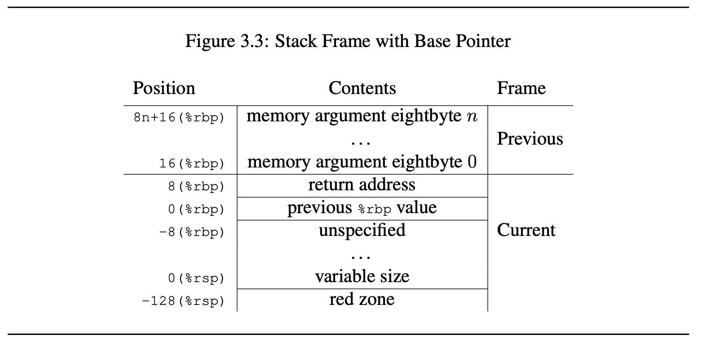
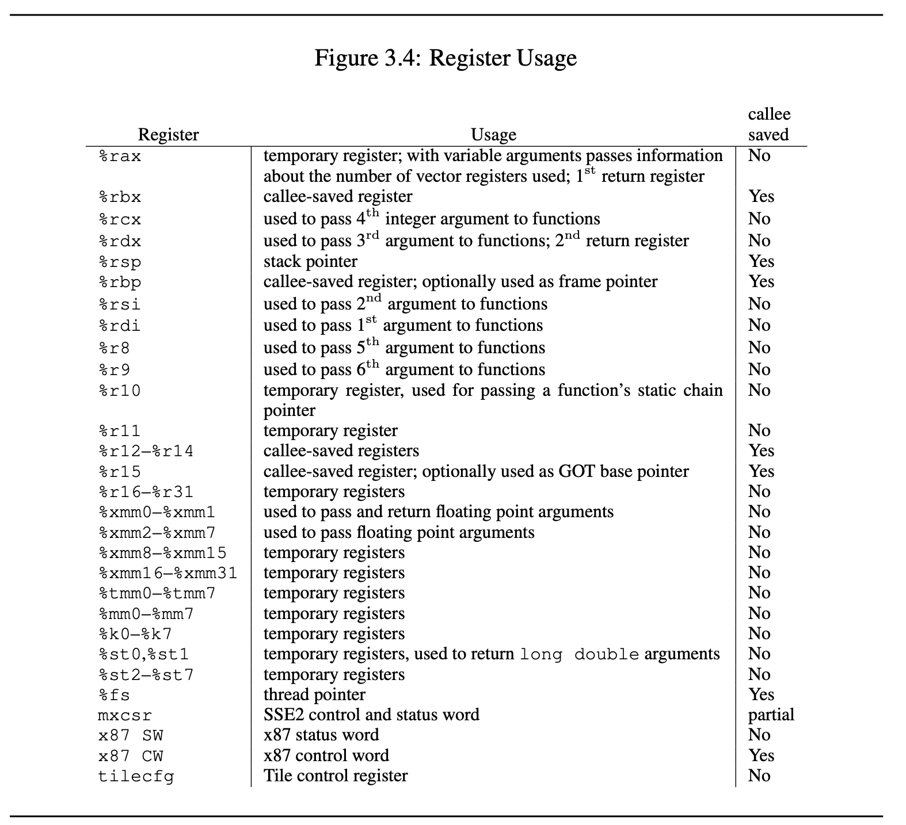

# Conventions from System V ELF x86-64-ABI psABI
[https://gitlab.com/x86-psABIs/x86-64-ABI](https://gitlab.com/x86-psABIs/x86-64-ABI)
- AMD64 ABI 1.0 – March 12, 2025 – 14:05

Critical points covered in extracted text

1. Register usage
1. Discussion stack alignment when calling a function
2. Red zone and constaints

## 3.2 Function Calling Sequence
This section describes the standard function calling sequence, including stack frame lay-
out, register usage, parameter passing and so on.

The standard calling sequence requirements apply only to global functions. Local
functions that are not reachable from other compilation units may use different conven-
tions. Nevertheless, it is recommended that all functions use the standard calling sequence
when possible.

### 3.2.1 Registers

The AMD64 architecture provides 16 general purpose 64-bit registers. In addition the
architecture provides 16 SSE registers, each 128 bits wide and 8 x87 floating point reg-
isters, each 80 bits wide. Each of the x87 floating point registers may be referred to in
MMX/3DNow! mode as a 64-bit register. All of these registers are global to all procedures
active for a given thread.

Intel AVX (Advanced Vector Extensions) provides 16 256-bit wide AVX registers
(%ymm0- %ymm15). The lower 128-bits of %ymm0- %ymm15 are aliased to the respective 128b-bit
SSE registers (%xmm0- %xmm15). Intel AVX-512 provides 32 512-bit wide SIMD registers
(%zmm0- %zmm31). The lower 128-bits of %zmm0- %zmm31 are aliased to the respective 128b-
bit SSE registers (%xmm0- %xmm31 (see footnote 7)). The lower 256-bits of %zmm0- %zmm31 are aliased to the
respective 256-bit AVX registers (%ymm0- %ymm31 (see footnote 7)). For purposes of parameter passing and
function return, %xmmN, %ymmN and %zmmN refer to the same register. Only one of them can
be used at the same time. We use vector register to refer to either SSE, AVX or AVX-512
register. In addition, Intel AVX-512 also provides 8 vector mask registers (%k0- %k7), each
64-bit wide.

Intel Advanced Matrix Extensions (Intel AMX) is a programming paradigm consisting
of two components: a set of 2-dimensional registers (tiles) representing sub-arrays from a
larger 2-dimensional memory image, and accelerators able to operate on tiles. Capability
of Intel AMX implementation is enumerated by palettes. Two palettes are supported:
palette 0 represents the initialized state and palette 1 consists of 8 tile registers (%tmm0-
%tmm7) of up to 1 KB size, which is controlled by a tile control register.
Intel APX (Advanced Performance Extensions) provides 16 general purpose 64-bit
registers (%r16- %r31).

This subsection discusses usage of each register. Registers %rbp, %rbx and %r12 through
%r15 “belong” to the calling function and the called function is required to preserve their
values. In other words, a called function must preserve these registers’ values for its
caller. Remaining registers “belong” to the called function.(see footnote 9) If a calling function wants
to preserve such a register value across a function call, it must save the value in its local stack frame.

---

Footnote: 7 %xmm16- %xmm31 are only available with Intel AVX-512.
Footnote: 8 %ymm16- %ymm31 are only available with Intel AVX-512.
Footnote: 9 Note that in contrast to the Intel386 ABI, %rdi, and %rsi belong to the called function, not the caller.

---

---

The CPU shall be in x87 mode upon entry to a function. Therefore, every function
that uses the MMX registers is required to issue an emms or femms instruction after using
MMX registers, before returning or calling another function.(see footnote 10) The direction flag DF
in the %rFLAGS register must be clear (set to “forward” direction) on function entry and
return. Other user flags have no specified role in the standard calling sequence and are not
preserved across calls.

The control bits of the MXCSR register are callee-saved (preserved across calls), while
the status bits are caller-saved (not preserved). The x87 status word register is caller-saved,
whereas the x87 control word is callee-saved.

### 3.2.2 The Stack Frame

In addition to registers, each function has a frame on the run-time stack. This stack grows
downwards from high addresses. Figure 3.3 shows the stack organization.

> The end of the input argument area shall be aligned on a 16 (32 or 64, if __m256 or
> __m512 is passed on stack) byte boundary.(see footnote 11) **In other words, the stack needs to be 16 (32
> or 64) byte aligned immediately before the call instruction is executed**. Once control has
> been transferred to the function entry point, i.e. immediately after the return address has
> been pushed, %rsp points to the return address, and the value of (%rsp + 8) is a multiple of
> 16 (32 or 64). (see footnote 12)

---

Footnote 10: All x87 registers are caller-saved, so callees that make use of the MMX registers may use the faster
femms instruction.

Footnote 11: The maximum aligned boundary is the maximum alignment of all variables passed on stack. In C11,
variable of type typedef struct { _Alignas (512) int i; } var_t; is aligned to 512 bytes.

Footnote 12: 12The conventional use of %rbp as a frame pointer for the stack frame may be avoided by using %rsp
(the stack pointer) to index into the stack frame. This technique saves two instructions in the prologue and
epilogue and makes one additional general-purpose register (%rbp) available.

---

The 128-byte area beyond the location pointed to by %rsp is considered to be reserved
and shall not be modified by signal or interrupt handlers. (see footnote 13) Therefore, functions may use
this area for temporary data that is not needed across function calls. In particular, leaf
functions may use this area for their entire stack frame, rather than adjusting the stack
pointer in the prologue and epilogue. This area is known as the red zone.

### 3.2.3 Parameter Passing

After the argument values have been computed, they are placed either in registers or
pushed on the stack. The way how values are passed is described in the following sec-
tions.

Definitions We first define a number of classes to classify arguments. The classes are
corresponding to AMD64 register classes and defined as:

INTEGER This class consists of integral types that fit into one of the general purpose
registers.

SSE The class consists of types that fit into a vector register.

SSEUP The class consists of types that fit into a vector register and can be passed and
returned in the upper bytes of it.

X87, X87UP These classes consists of types that will be returned via the x87 FPU.

COMPLEX_X87 This class consists of types that will be returned via the x87 FPU.

NO_CLASS This class is used as initializer in the algorithms. It will be used for padding
and empty structures and unions.

MEMORY This class consists of types that will be passed and returned in memory via
the stack.

---

Footnote 13: Locations within 128 bytes can be addressed using one-byte displacements.

---

Skipping Casification see doc

...

**Passing** for passing as follows:

Once arguments are classified, the registers get assigned (in left-to-right order)
1. If the class is MEMORY, pass the argument on the stack at an address respecting the
arguments alignment (which might be more than its natural alignement).
2. If the class is INTEGER, the next available register of the sequence %rdi, %rsi, %rdx,
%rcx, %r8 and %r9 is used19
.
3. If the class is SSE, the next available vector register is used, the registers are taken
in the order from %xmm0 to %xmm7.
4. If the class is SSEUP, the eightbyte is passed in the next available eightbyte chunk
of the last used vector register.
5. If the class is X87, X87UP or COMPLEX_X87, it is passed in memory.
When a value of a type of class INTEGER is returned or passed in a register or on the
stack, the excess bits that would not be present in the memory representation of the type
(see figure 3.1) are unspecified. (see foonote 20)

---

Footnote 20: That is, the consumer side of those values needs to extend them or use short form instruction variants. As
in the memory representation, for a value of type _Bool, the lowest 8 bits are significant, together forming
the value 0 or 1.

---

---

If there are no registers available for any eightbyte of an argument, the whole argument
is passed on the stack. If registers have already been assigned for some eightbytes of such
an argument, the assignments get reverted.

Once registers are assigned, the arguments passed in memory are pushed on the stack
in reversed (right-to-left (see footnote 21)) order.

For calls that may call functions that use varargs or stdargs (prototype-less calls or calls
to functions containing ellipsis (...) in the declaration) %al(see footnote 22) is used as hidden argument
to specify the number of vector registers used. The contents of %al do not need to match
exactly the number of registers, but must be an upper bound on the number of vector
registers used and is in the range 0–8 inclusive.

When passing __m256 or __m512 arguments to functions that use varargs or stdarg,
function prototypes must be provided. Otherwise, the run-time behavior is undefined.

**Returning** of Values 

The returning of values is done according to the following algorithm:

1. Classify the return type with the classification algorithm.

2. If the type has class MEMORY, then the caller provides space for the return value
and passes the address of this storage in %rdi as if it were the first argument to the
function. In effect, this address becomes a “hidden” first argument. This storage
must not overlap any data visible to the callee through other names than this argu-
ment.

On return %rax will contain the address that has been passed in by the caller in %rdi.

3. If the class is INTEGER, the next available register of the sequence %rax, %rdx is
used.

4. If the class is SSE, the next available vector register of the sequence %xmm0, %xmm1 is
used.

5. If the class is SSEUP, the eightbyte is returned in the next available eightbyte chunk
of the last used vector register.

6. If the class is X87, the value is returned on the X87 stack in %st0 as 80-bit x87
number.

7. If the class is X87UP, the value is returned together with the previous X87 value in
%st0.

8. If the class is COMPLEX_X87, the real part of the value is returned in %st0 and the
imaginary part in %st1.

---

Footnote 21: Right-to-left order on the stack makes the handling of functions that take a variable number of arguments
simpler. The location of the first argument can always be computed statically, based on the type of that
argument. It would be difficult to compute the address of the first argument if the arguments were pushed in
left-to-right order.

Footnote 22: Note that the rest of %rax is undefined, only the contents of %al is defined.

---

## 3.3 Operating System Interface

### 3.3.1 Exception Interface

As the AMD64 manuals describe, the processor changes mode to handle exceptions,
which may be synchronous, floating-point/coprocessor or asynchronous. Synchronous
and floating-point/coprocessor exceptions, being caused by instruction execution, can be
explicitly generated by a process. This section, therefore, specifies those exception types
with defined behavior. The AMD64 architecture classifies exceptions as faults, traps, and
aborts. See the Intel386 ABI for more information about their differences.

**Hardware Exception Types**

The operating system defines the correspondence between hardware exceptions and the
signals specified by signal (BA_OS) as shown in table 3.2. Contrary to the i386 archi-
tecture, the AMD64 does not define any instructions that generate a bounds check fault in
long mode.

### 3.3.2 Virtual Address Space

Although the AMD64 architecture uses 64-bit pointers, implementations are only required
to handle 48-bit addresses. Therefore, conforming processes may only use addresses from
0x00000000 00000000 to 0x00007fff ffffffff (see footnote 23).

---

Footnote 23: 0x0000ffff ffffffff is not a canonical address and cannot be used.

---

## A.2 AMD64 Linux Kernel Conventions

The section is informative only.

## A.2.1 Calling Conventions

The Linux AMD64 kernel uses internally the same calling conventions as user-level appli-
cations (see section 3.2.3 for details). User-level applications that like to call system calls
should use the functions from the C library. The interface between the C library and the
Linux kernel is the same as for the user-level applications with the following differences:

1. User-level applications use as integer registers for passing the sequence %rdi, %rsi,
%rdx, %rcx, %r8 and %r9. The kernel interface uses %rdi, %rsi, %rdx, %r10, %r8 and
%r9.
2. A system-call is done via the syscall instruction. The kernel clobbers registers %rcx
and %r11 but preserves all other registers except %rax.
3. The number of the syscall has to be passed in register %rax.
4. System-calls are limited to six arguments, no argument is passed directly on the
stack.
5. Returning from the syscall, register %rax contains the result of the system-call. A
value in the range between -4095 and -1 indicates an error, it is-errno.
6. Only values of class INTEGER or class MEMORY are passed to the kernel.
A.2.2 Stack Layout
The Linux kernel may align the end of the input argument area to a 8, instead of 16, byte
boundary. It does not honor the red zone (see section 3.2.2) and therefore this area is
not allowed to be used by kernel code. Kernel code should be compiled by GCC with the
option -mno-red-zone.
A.2.3 Miscellaneous Remarks
Linux Kernel code is not allowed to change the x87 and SSE units. If those are changed
by kernel code, they have to be restored properly before sleeping or leaving the kernel. On
preemptive kernels also more precautions may be needed.